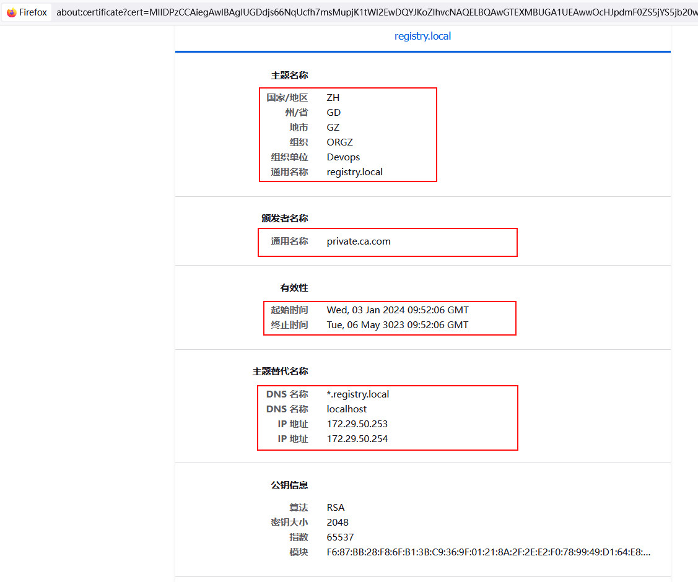

## Client客户端访问

### 1）CURL/Browser

- 信息查看: 内嵌列表页| UI面板

**HTTP**

```bash
172.29.50.253:6200
curl http://172.29.50.253:6200
```

**HTTPS**

```bash
# ca
./certs/ca.crt

# curl
headless @ barge in .../build/certs |17:52:22  |dev ↑2 U:3 ✗| 
$ curl --cacert ./ca.crt  https://localhost:8143

# browser
https://www.onitroad.com/jc/linux/faq/firefox_-add-a-trusted-ca.html #Firefox：添加受信任的 CA
```



### 2）Docker

**HTTPS**

- import ca.crt

```bash
domain=default.registry.local
echo 172.29.50.253 $domain |sudo tee -a /etc/hosts
certDir=/etc/docker/certs.d/$domain:8143
sudo mkdir -p $certDir
# curl -o $certDir/ca.crt https://gitee.com/g-devops/docker-registry/raw/dev/build/docker-registry/certs/ca.crt
cat <<EOF |sudo tee $certDir/ca.crt
-----BEGIN CERTIFICATE-----
MIIDFTCCAf2gAwIBAgIUeIsIWSYpPikMcufBZ1yrb65hS5IwDQYJKoZIhvcNAQEL
BQAwGTEXMBUGA1UEAwwOcHJpdmF0ZS5jYS5jb20wIBcNMjQwMTAzMDkzMTUwWhgP
MzAyMzA1MDYwOTMxNTBaMBkxFzAVBgNVBAMMDnByaXZhdGUuY2EuY29tMIIBIjAN
BgkqhkiG9w0BAQEFAAOCAQ8AMIIBCgKCAQEAqz5CyqRyWZKC/vUzZ6b27pAdyhU9
asEoxjzAnSfnZktzKZPFYrlOAmgleXOFD3BDmQ6iWf+UGOXNf0XJ5trtIvGC0Awy
gdjq9yUzN619nwWCa2I1HJGGhCwT3E9de1xk7czUAIJnV91d7VcACx2PKFit/5MK
UKzRd+UphP9uQONMHV4fq19E8qfovu3jrDpEw8pAoRDd+OOQY6XqJFI4LWYdutzT
HA1L0PZS3/n6R+vb/qJqoL4DD5jfvncP8s67LLQoPjdSfsKBFna1TRHRUf5wudg5
n0GIVDTqkVVHqTqM8DzlFI1m7UgWzDwoGChUbPoVFlY3l/K4NWE0+7AzaQIDAQAB
o1MwUTAdBgNVHQ4EFgQUxEFEr6fz4STBDTsB9ysxUUWLx34wHwYDVR0jBBgwFoAU
xEFEr6fz4STBDTsB9ysxUUWLx34wDwYDVR0TAQH/BAUwAwEB/zANBgkqhkiG9w0B
AQsFAAOCAQEARQbrzEsO/DCLEnwJdH1wdDTO7njdobILlSIdTgSEbX8Dlfq/FovE
EqRJ59s2Z+QSoPAF7RW93gNjIRlKRVMDHuVh1MfdfkESVUidO0k/45jbkjsN6ohI
28Pla7TQvBqyM8DwIcXd6t6DSq0c+yu+a+wzZV6ybCH9GdsjROnJL8DtJqmFWkqS
VmO/Vtsf5yBnyHX4j5zhYnq4wKijKi6ph7AG3DhJB4pX4vVjBJ2GoFKnKnH7gmj/
EXFbbi2ZUe4pGXQ6tg8S4R7qTtH1nmMPEIIo7PVUIv5hbutYlfAfhex32UbmJOzZ
sJsBivnI1I8Mc3dfsjoeLKgUpRTsg/9Kkw==
-----END CERTIFICATE-----
EOF

```

- docker login/push

```bash
# Error response from daemon: Get https://$domain:8143/v2/: x509: certificate is valid for deploy.xx.com.ssl, not $domain
domain=default.registry.local
echo admin123 |docker login $domain:8143 --username=admin --password-stdin

# pushImg
docker pull busybox
docker tag busybox $domain:8143/busybox
docker push $domain:8143/busybox

# abc/busybox
docker tag busybox $domain:8143/abc/busybox:v2
docker push $domain:8143/abc/busybox:v2

# host-21-67:/etc/docker/certs.d/$domain:8143 # docker push $domain:8143/busybox
The push refers to repository [$domain:8143/busybox]
01fd6df81c8e: Pushed 
latest: digest: sha256:62ffc2ed7554e4c6d360bce40bbcf196573dd27c4ce080641a2c59867e732dee size: 527

```

**HTTP**

- insecure-registries: `0.0.0.0/0` AnyIP

```bash
# "insecure-registries": ["0.0.0.0/0", ...],
[root@cent7-23-195 ~]# cat /etc/docker/daemon.json 
{
  "registry-mirrors": ["https://docker.mirrors.ustc.edu.cn"], 
  "hosts": ["unix:///var/run/docker.sock"],
  "insecure-registries": ["0.0.0.0/0", "127.0.0.1/8", "harbor.xxx.com", "deploy.xxx.com"],
  "max-concurrent-downloads": 10,
  "log-driver": "json-file",
  "log-level": "warn",
  "log-opts": {
    "max-size": "10m",
    "max-file": "3"
  },
  "default-address-pools":[
        {"base":"10.18.0.0/16","size":24}
  ],
  "data-root": "/opt/docker-data",
  "experimental": true
}
```

- login, pull

```bash
[root@cent7-23-195 ~]# echo admin123 |docker login 172.29.50.253:6200 --username=admin --password-stdin
WARNING! Your password will be stored unencrypted in /root/.docker/config.json.
Configure a credential helper to remove this warning. See
https://docs.docker.com/engine/reference/commandline/login/#credentials-store

Login Succeeded
[root@cent7-23-195 ~]# docker pull 172.29.50.253:6200/infrasync/alpine:3.13.12
3.13.12: Pulling from infrasync/alpine
Digest: sha256:d0642e6d9bedb4e4f301a936931f8f4a49824bb0951960f9f1de9878f37eead5
Status: Downloaded newer image for 172.29.50.253:6200/infrasync/alpine:3.13.12
172.29.50.253:6200/infrasync/alpine:3.13.12
```